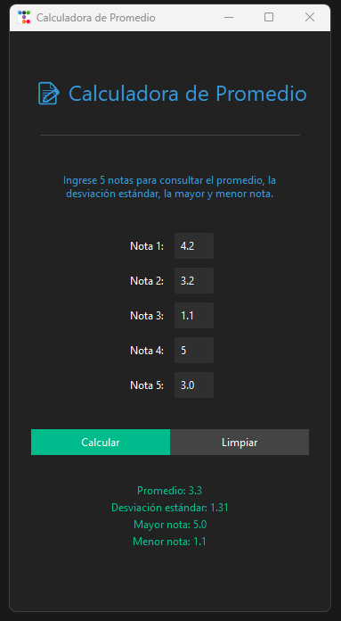
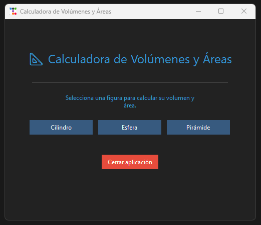
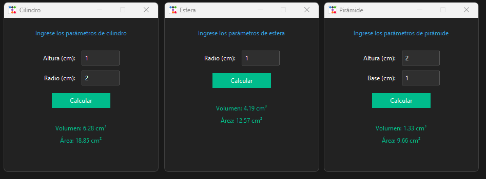

# 📘 Tarea 3 de Programación Orientada a Objetos

---

## 🚀 Nombre
Alejandro Valencia Ossa

---

## 🧠 Contenido de las carpetas

En cada una de las carpetas se encuentran los ejercicios propuestos. Ambas interfaces gráficas se desarrollaron con un diseño oscuro moderno y un estilo minimalista que las hace visualmente cómodas e intuitivas.

### 📝 Promedio

La carpeta calculadora contiene el archivo .py con la interfaz gráfica de usuario de una herramienta que calcula el promedio, la desviación estándar, la mayor y menor nota de 5 notas ingresadas por el usuario. La interfaz detecta si los valores ingresados como notas son adecuados y si todos los valores han sido ingresados y, en caso contrario, informa al usuario. Se adjuntan imágenes de la interfaz y su respectivo diagrama de clases y casos de uso. 

#### Interfaz gráfica de usuario

#### Diagrama de clase

#### Casos de uso

### 🔴 Figuras

La carpeta figuras contiene el archivo .py con la interfaz gráfica de usuario para calcular el área y el volumen de tres figuras geométricas: Una cilindro, una esfera y una pirámide. El usuario puede elegir una de estas tres figuras, lo cual despliega una ventana adicional en la cual pueden introducirse los parámetros de la figura. La interfaz detecta si los parámetros ingresados son válidos y si se han ingresado todos los parámetros y, en caso contrario, informa al usuario. Se adjuntan imágenes de la interfaz y su respectivo diagrama de clases y casos de uso. 

#### Interfaz gráfica de usuario

#### Diagrama de clase

#### Casos de uso

